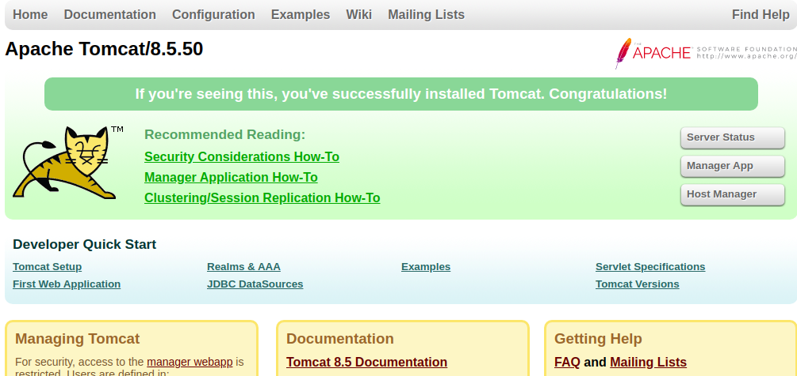

Ansible Role: osm_tomcat
=========
An ansible role to install and configure Apache Tomcat.

Version History
---------------

|**Date**| **Version**| **Description**| **Changed By** |
|----------|---------|---------------|-----------------|
|**June '15** | v.1.0 | Initial Draft | Sudipt Sharma |


Supported OS
------------
  * CentOS : 6/7
  * Redhat : 6/7
  * Ubuntu :14/16
  * Amazon Linux

Dependencies
------------
Java must be pre installed and java version must be compatible for installing tomcat version

|**Tomcat Version** | **Java Version**|
|---------------|-------------|
|    7.0        | 6 or later  |
|     8.0       | 7 or later  |
|    8.5        | 7 or later  |

Role Variables
--------------
| **Variables** | **Default Values** | **Description** |
|-----------|----------------|-------------|
| tomcat_version | 8.5.40 | Tomcat version to be installed |
| tomcat_user | tomcat | User name by which tomcat will run |
| tomcat_group | tomcat | Group name by which tomcat will be accessible |
| tomcat_service_name | tomcat | Service name of tomcat |
| tomcat_port_connector | 8090 |  Port no. on which tomcat will be accessible |
| tomcat_jvm_memory_percentage_xms | 15 | Minimum memory to tomcat process |
| tomcat_jvm_memory_percentage_xmx | 55 | Max memory to tomcat process |

Inventory
----------
An inventory for tomcat installation should look like this:-
```ini
[tomcathosthost]                 
192.168.1.198    ansible_user=ubuntu   
192.168.3.201    ansible_user=opstree 
```

Example Playbook
----------------

* Here is an example playbook:-
  
```
- hosts: local

  roles:
    - role: osm_tomcat

ansible-playbook tomcat.yml
```
* ansible-playbook site.yml

**After the successful installation of tomcat, browse through the tomcat url and you will get to see something like this**


Future Proposed Changes
-----------------------

References
----------
- **[software](https://tomcat.apache.org/tomcat-8.5-doc/setup.html)**

# Author Information
  
```
Name :- Rohit Bansal
Email :- rohit.bansal@opstree.com
```